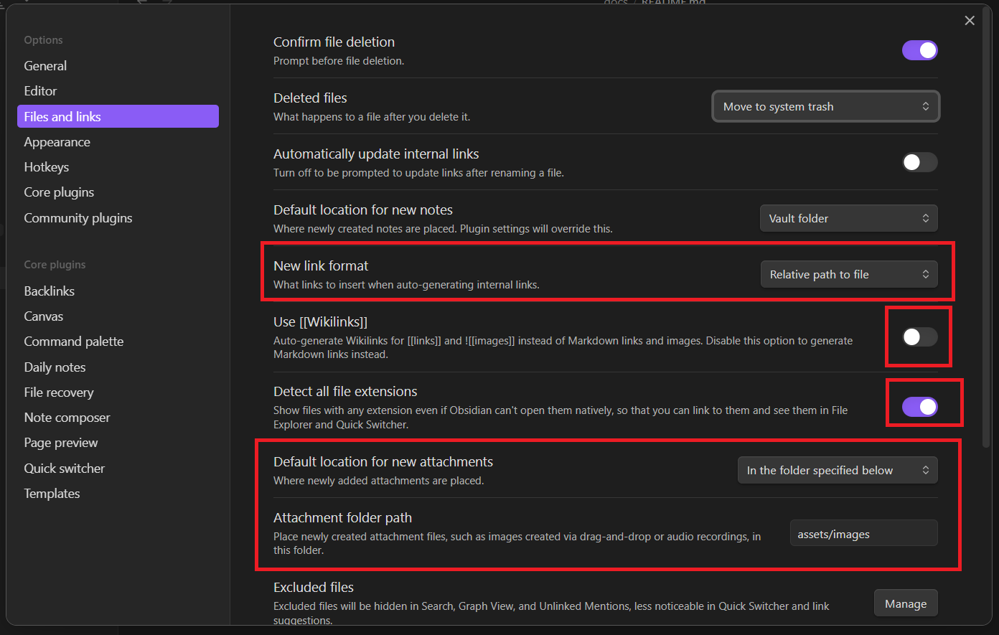
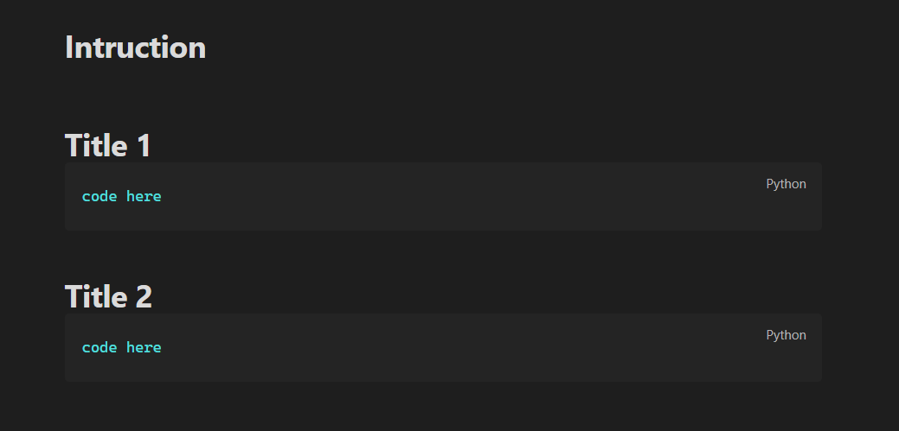

# Setup Obsidian

Vào mục setting và làm theo như hình ảnh 

 

# Templates

- Ở đây là cách chèn vào templates để khi gọi lệnh nó sẽ nhanh chóng mà có 1 template mà mình mong muốn, dưới đây là cách chèn template và setup của nó
## Bước 1: Setup template
- Tạo 1 note mới trong folder templates: Intruction

* Thêm cấu trúc ví dụ mà mình hay sử dụng vào 

## Bước 2: Cài đặt trong setting

- Vào Setting -> Templates. Chọn địa chỉ ở folder lưu các templates

## Bước 3: Sử dụng
- Chọn 1 readme bất kì 
- Gõ **Ctrl + P** và chọn **Templates: Insert template** . Chọn template mình muốn dùng, ví dụ: **Instruction**

# Explain hotkeys and app json
- Trong folder .obsidian, rồi copy hotkey của mình vào để sử dụng shortkey. 
- Trong app thì bỏ vào folder .obsidian 

